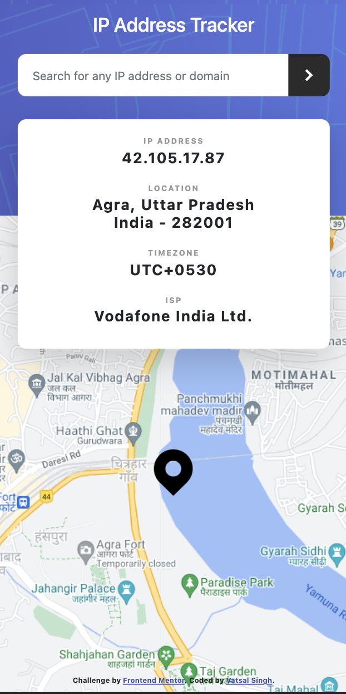

# Frontend Mentor - IP address tracker solution

This is a solution to the [IP address tracker challenge on Frontend Mentor](https://www.frontendmentor.io/challenges/ip-address-tracker-I8-0yYAH0). Frontend Mentor challenges help you improve your coding skills by building realistic projects.

## Table of contents

- [Overview](#overview)
  - [The challenge](#the-challenge)
  - [Screenshot](#screenshot)
  - [Links](#links)
- [My process](#my-process)
  - [Built with](#built-with)
  - [What I learned](#what-i-learned)
  - [Continued development](#continued-development)
  - [Useful resources](#useful-resources)
- [Author](#author)
- [Acknowledgments](#acknowledgments)

## Overview

### The challenge

Users should be able to:

- View the optimal layout for each page depending on their device's screen size
- See hover states for all interactive elements on the page
- See their own IP address on the map on the initial page load
- Search for any IP addresses or domains and see the key information and location

### Screenshot




### Links

- Solution URL: [https://www.frontendmentor.io/solutions/ip-address-tracker-using-bootstrap-jquery-and-leafletjs-with-oops-1jLST_e1s](https://www.frontendmentor.io/solutions/ip-address-tracker-using-bootstrap-jquery-and-leafletjs-with-oops-1jLST_e1s)
- Live Site URL: [https://vatsalsinghkv.github.io/ip-address-tracker](https://vatsalsinghkv.github.io/ip-address-tracker/)

## My process

### Built with

- Semantic HTML5 markup
- CSS custom properties
- Flexbox
- CSS Grid
- [Bootstrap-5](https://getbootstrap.com/) - Front-End Framework
- [jQuery](https://jquery.com/) - JS library

### What I learned

I've learned lot of stuff in this challenge:

- Object Oriented Programming

```js
class App {
	// Data
	#map;
	#mapZoom = 15;
	#coords;
	#marker;

	constructor() {
		// Some Code
	}

	_getIPData() {
		// Some Code
	}

	_setIPData() {
		// Some Code
	}

	_loadMap() {
		// Some Code
	}

	#_setMarker() {
		// Some Code
	}
}

const app = new App();
```

- How to get fetch from APIs

```js
fetch(`https://ipapi.co/json`)
  .then(res =>  res.json())
  .then(data => {
    if (data.error) throw new Error(`Error: ${data.reason}.`);
    this._setIPData(data);
  })
  .catch(e =>
    alert(`${	e.message} Try again!`)
  );
}
```

- Grid System of Bootstrap-5

```html
<main class="row">
	<div class="col-lg-5"></div>

	<div class="col-lg-12">
		<div class="row row-cols-lg-4">
			<div>1</div>
			<div>2</div>
			<div>3</div>
			<div>4</div>
		</div>
	</div>
</main>
```

- How to use LealletsJs

```js
const map = L.map('mapID').setView([lat, lon], 15);

// Google Map
L.tileLayer('http://{s}.google.com/vt/lyrs=m&x={x}&y={y}&z={z}', {
	maxZoom: 20,
	subdomains: ['mt0', 'mt1', 'mt2', 'mt3'],
}).addTo(map);

L.marker([lat, lon], {
	icon: L.icon({
		iconUrl: 'images/icon-location.svg',
		iconAnchor: [24, 56],
	}),
})
	.addTo(map)
	.openPopup();
```

### Continued development

### Stuff I find usefull and want to learn:

- Node.js
- Express
- React
- CSS Animations
- JS Regular Expressipns
- Data Structures
- Databases (MongoDB)
- Flutter & Dart

### Useful resources

- [TheNetNinja Youtube](https://www.youtube.com/c/TheNetNinja) - This helped me learn jQuery, GitHub, CSS Grid. This guy is legend there's lot of stuff to learn, which I will be learning in future.
- [GeeksForGeeks](https://www.geeksforgeeks.org/) - This is amazing website for articles, snippets, projects, algorithms etc.
- [MDN Docs](https://developer.mozilla.org/en-US/) - This is an amazing reference which helped me finally understand detailed concepts like data- attr, aria attr, input range etc.

## Author

- Frontend Mentor - [@vatsalsinghkv](https://www.frontendmentor.io/profile/vatsalsinghkv)
- Github - [@vatsalsinghkv](https://github.com/vatsalsinghkv)
- Twitter - [@vatsalsinghkv](https://www.twitter.com/vatsalsinghkv)
- Instagram - [@vatsal.sing.hkv](https://www.instagram.com/vatsal.singh.kv)
- Facebook - [@vatsalsinghkv](https://www.facebook.com/vatsal.singh.kv)

## Acknowledgments

- [Leaflet with GitHub Pages Issue](https://stackoverflow.com/a/38137636/14076424) - This stackoverflow anser was life saver it told we should use [Leaflet recommended CDNs](http://leafletjs.com/download.html)
- [How to remove marker from map?](https://stackoverflow.com/a/10030930/14076424) - This answer on stackoverflow really helped me.
